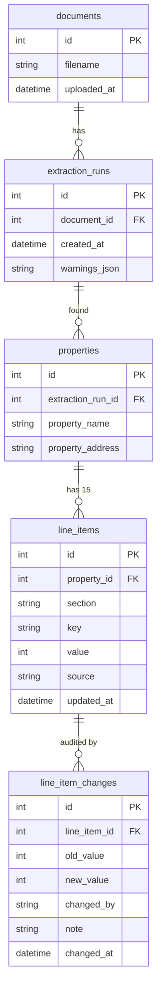
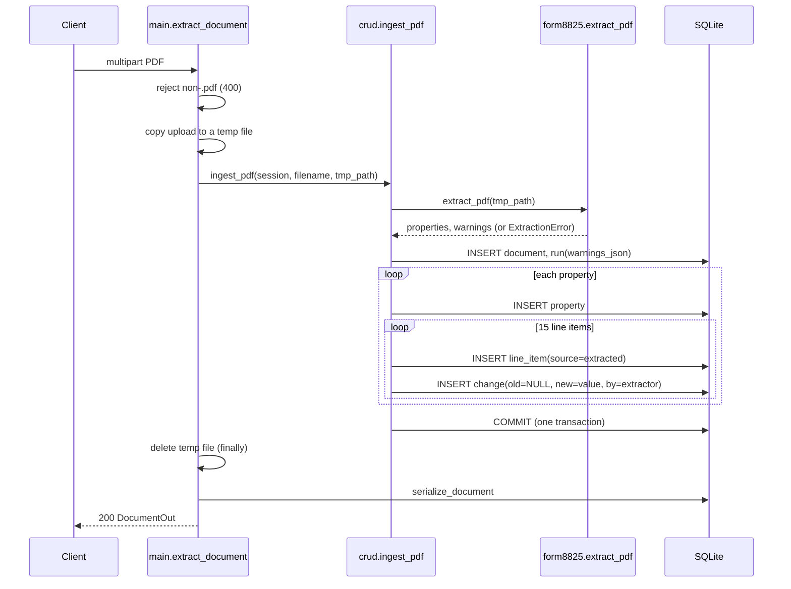

# Backend logic (`backend/`)

FastAPI + SQLModel + SQLite service that accepts a Form 8825 PDF, runs the
extractor from [`form8825/`](EXTRACTION_LOGIC.md), stores the result, lets a
user correct individual numbers, and keeps a full audit trail of every value.

- [Architecture](#architecture)
- [Files](#files)
- [Running and configuration](#running-and-configuration)
- [Database design](#database-design)
- [Application logic](#application-logic)
- [API reference](#api-reference)
- [Error handling](#error-handling)
- [Design decisions](#design-decisions)
- [Known limitations](#known-limitations)

---

## Architecture

```
 React UI (Vite :5173)
        │  /api/*  (Vite proxy → :8000)
        ▼
 ┌─────────────────────── FastAPI (backend/main.py) ───────────────────────┐
 │  routes: validate input, map exceptions to HTTP status                  │
 │        │                                                                │
 │        ▼                                                                │
 │  crud.py: all business logic (ingest, serialize, edit, history, delete) │
 │     │            │                                                      │
 │     ▼            ▼                                                      │
 │  form8825.extract   models.py (SQLModel tables) ──► SQLite file         │
 │  (PDF → dicts)      schemas.py (Pydantic API shapes)                    │
 └──────────────────────────────────────────────────────────────────────────┘
```

Layering rules:

- **`main.py`** owns HTTP concerns only: status codes, upload handling, dependency injection.
- **`crud.py`** owns every read/write rule. Routes never touch tables directly, except a lightweight `session.get(Document, id)` existence check in `GET /documents/{id}`.
- **`models.py`** describes storage. **`schemas.py`** describes the wire format. They are deliberately different (see [Design decisions](#design-decisions)).
- Dependency direction: `backend` → `form8825`, never the reverse.

---

## Files

| File | Responsibility |
|---|---|
| `main.py` | App, CORS, startup hook, the 6 routes. |
| `db.py` | SQLite engine, `init_db()`, `get_session()` dependency. |
| `models.py` | The 5 SQLModel tables. |
| `schemas.py` | Pydantic request/response models. |
| `crud.py` | Business logic: `ingest_pdf`, `serialize_document`, `list_documents`, `update_line_item`, `line_item_history`, `delete_document`, plus two id-lookup helpers. |
| `form8825.db` | The SQLite file. Created on first start, gitignored. |

---

## Running and configuration

```bash
uvicorn backend.main:app --reload --port 8000      # from the repo root
# or, with uv:  uv run uvicorn backend.main:app --reload --port 8000
```

Interactive docs: `http://127.0.0.1:8000/docs`.

| Setting | Where | Value |
|---|---|---|
| Database | `db.py` | `sqlite:///backend/form8825.db` (path resolved relative to `db.py`, so the working directory doesn't matter) |
| SQLite threading | `db.py` | `check_same_thread=False`, required because FastAPI runs sync route handlers on a thread pool |
| CORS origins | `main.py` | `http://localhost:5173`, `http://127.0.0.1:5173`; all methods and headers |
| Schema creation | `main.py` startup | `init_db()` → `SQLModel.metadata.create_all(engine)` |

There is no `.env` or other configuration file. The frontend does not use
CORS in dev, because Vite proxies `/api` to port 8000 (see
[FRONTEND_LOGIC.md](FRONTEND_LOGIC.md)); the CORS entry is for direct calls.

`init_db()` imports `backend.models` first so every table is registered on
`SQLModel.metadata` before `create_all` runs. `create_all` only creates
missing tables. It never alters existing ones, so a column change needs a
migration or a fresh database file.

---

## Database design

### Entity-relationship diagram



### Tables

**`documents`**: one row per uploaded PDF.

| Column | Type | Notes |
|---|---|---|
| `id` | int PK | autoincrement |
| `filename` | str | the name the client uploaded (not the temp path) |
| `uploaded_at` | datetime | UTC, set on insert |

**`extraction_runs`**: one row per extraction attempt on a document.

| Column | Type | Notes |
|---|---|---|
| `id` | int PK | |
| `document_id` | int FK → `documents.id` | |
| `created_at` | datetime | UTC. "Latest run" is the max of this. |
| `warnings_json` | str | JSON-encoded `list[str]` of the extractor's warning messages |

Exists so the same document can be re-extracted (e.g. after an extractor
improvement) without losing the earlier result. Today every upload creates
exactly one run; there is no re-extract endpoint yet.

**`properties`**: one row per property column found by a run.

| Column | Type | Notes |
|---|---|---|
| `id` | int PK | |
| `extraction_run_id` | int FK → `extraction_runs.id` | |
| `property_name` | str | the column letter: `A`, `B`, `C`, `D` |
| `property_address` | str | default `""` |

**`line_items`**: the *current* value of each income/expense field. Always 15 rows per property (2 income + 13 expense).

| Column | Type | Notes |
|---|---|---|
| `id` | int PK | this is the id the UI edits by |
| `property_id` | int FK → `properties.id` | |
| `section` | str | `"income"` or `"expense"` |
| `key` | str | e.g. `gross_rents`, `advertising` (see the mapping in [EXTRACTION_LOGIC.md](EXTRACTION_LOGIC.md#schemapy-the-vocabulary)) |
| `value` | int | whole dollars, may be negative |
| `source` | str | `"extracted"` until edited, then `"manual"` |
| `updated_at` | datetime | UTC. Bumped on edit. |

**`line_item_changes`**: append-only audit log. **Never updated, never deleted** except when its whole document is deleted.

| Column | Type | Notes |
|---|---|---|
| `id` | int PK | |
| `line_item_id` | int FK → `line_items.id` | |
| `old_value` | int, nullable | `NULL` for the initial extracted entry |
| `new_value` | int | |
| `changed_by` | str | `"extractor"` for ingest, otherwise whatever the client sent (default `"user"`) |
| `note` | str, nullable | free text |
| `changed_at` | datetime | UTC |

### What is deliberately *not* stored

**Totals** (2c total income, 18 total expenses, 19 net income, and the grand
total) are never persisted. They are recomputed from `line_items` on every
read. This makes it impossible for a stored total to disagree with the
numbers beneath it, and it means an edit needs no cascading update.

### Modeling choices

- **Row per line item** (key/value), not a wide table with a column per line. Adding a form line needs no schema migration, the audit log can point at one row, and `source` is tracked per field.
- **Current value and history are separate.** `line_items` answers "what is it now" in one lookup; `line_item_changes` answers "how did it get there". Neither needs to be reconstructed from the other.
- **The first history row is the extraction itself** (`old_value = NULL`, `changed_by = "extractor"`), so history is complete from the first moment: there is no "original value" that lives somewhere other than the log.
- **`source` is sticky.** Once edited, a row stays `"manual"` even if the value is later set back to the extracted number. The log shows the round trip.
- **Integers, not decimals.** The form is in whole dollars, so `int` avoids float error entirely.

### Indexes and integrity

Only primary keys are indexed. Foreign keys are declared, but SQLite does not
enforce them unless `PRAGMA foreign_keys=ON` is set per connection, which
`db.py` does not do. There is no `ON DELETE CASCADE` either, so
`delete_document` removes children manually, deepest first (see below).

### Row counts for scale

One document with P properties creates: 1 `documents` + 1 `extraction_runs` +
P `properties` + 15·P `line_items` + 15·P initial `line_item_changes`. Three
properties is 1 + 1 + 3 + 45 + 45 = 95 rows.

---

## Application logic

### 1. Ingest: `POST /api/extract` → `crud.ingest_pdf`



Details that matter:

- **The route is a plain `def`**, so FastAPI runs it on a worker thread. The extractor is blocking CPU/IO and must not run on the event loop.
- **The upload is written to a temp file** because `pdfplumber` needs a path. The temp file is always deleted in `finally`, including on failure.
- **One transaction.** Flushes assign ids as the tree is built, but nothing is committed until the end. If extraction raises (before any insert) or anything fails midway, no partial document is left behind.
- **`ExtractionError` → HTTP 400.** An unopenable file is the caller's problem, not a server fault. The message names the *uploaded* filename and the underlying cause (`exc.__cause__`), not the temp path.
- **Every line item is written**, including zeros, using the key lists from `form8825.schema`. A property therefore always has all 15 rows, regardless of what the PDF contained.
- **Only this function writes extraction output.** After it, the only mutation is a manual edit.
- **Warnings are stored as message strings.** The property letter attached to a warning by the extractor is dropped.
- **Re-uploading the same file creates a second, independent document.** There is no dedup.

### 2. Read: `crud.serialize_document`

Builds the nested `DocumentOut` from flat rows:

1. Find the document's **latest run** (`ORDER BY created_at DESC LIMIT 1`).
2. Decode `warnings_json`.
3. Load that run's properties. Older runs are ignored.
4. For each property, load its line items and split them by `section` into `income_line_items` / `expense_line_items`, each a dict keyed by `key`.
5. **Compute totals** per property:
   ```
   total_rental_income = sum(income values)
   total_expenses      = sum(expense values)
   net_income          = total_rental_income - total_expenses
   ```
6. `grand_total_net_income = sum(property.net_income)`.

Because totals are summed from current `line_items` values, an edited number
flows through automatically. Note that the income total is the sum of *all*
income rows, which today are exactly `gross_rents + other_income`, matching
line 2c.

### 3. List: `crud.list_documents`

All documents newest first, each with `property_count` from its latest run.
It is a summary only: no line items, no warnings.

### 4. Edit: `PATCH /api/line-items/{id}` → `crud.update_line_item`

```
old = item.value
item.value      = new_value
item.source     = "manual"
item.updated_at = now (UTC)
INSERT line_item_changes (old_value=old, new_value, changed_by, note)
COMMIT
```

- The line item update and its audit row are in **one commit**, so a value can never change without a log entry, or vice versa.
- Missing id → `ValueError` → HTTP 404.
- `value` is validated as an `int` by Pydantic (a fractional number or a non-number gets 422).
- `changed_by` defaults to `"user"`; `note` is optional. There is no authentication, so `changed_by` is whatever the client sends.
- The backend does **not** skip no-op edits. Submitting the same value writes a history row and flips `source` to `manual`. (The UI avoids sending unchanged values.)
- The response is the single updated `LineItemOut`, not the whole document. Clients re-fetch the document to get fresh totals.

### 5. History: `GET /api/line-items/{id}/history` → `crud.line_item_history`

Returns every `line_item_changes` row for the item, **oldest first**. The
first entry is always the extractor's. An unknown id returns `[]`, not 404.

### 6. Delete: `DELETE /api/documents/{id}` → `crud.delete_document`

No cascade is configured, so deletion walks the tree bottom-up inside one
transaction:

```
for each run of the document:
  for each property of the run:
    for each line_item of the property:
      delete its changes
      delete the line_item
    delete the property
  delete the run
delete the document
COMMIT
```

Returns `False` if the document is missing (→ 404). Success returns
`204 No Content`. **This destroys the audit trail for that document**, which
is intentional here: the log belongs to the document.

### 7. Id-lookup helpers

`get_property_id_for_line_item` and `get_document_id_for_property` walk one FK
up the chain (line item → property → run → document). They are not used by
any route today; they exist for features that need to resolve an item back to
its owning document.

---

## API reference

Base path `/api`. All bodies are JSON except the upload.

| Method | Path | Body | Success | Errors |
|---|---|---|---|---|
| `POST` | `/api/extract` | `multipart/form-data`, field `file` | `200` `DocumentOut` | `400` not a `.pdf` name / unreadable PDF; `422` missing `file` |
| `GET` | `/api/documents` | none | `200` `DocumentSummary[]`, newest first | none |
| `GET` | `/api/documents/{id}` | none | `200` `DocumentOut` | `404` |
| `DELETE` | `/api/documents/{id}` | none | `204` | `404` |
| `PATCH` | `/api/line-items/{id}` | `UpdateLineItemRequest` | `200` `LineItemOut` | `404`, `422` |
| `GET` | `/api/line-items/{id}/history` | none | `200` `LineItemChangeOut[]`, oldest first | none |

### Schemas (`schemas.py`)

```jsonc
// DocumentOut
{
  "id": 1,
  "filename": "f8825_multi.pdf",
  "uploaded_at": "2026-09-21T17:17:57.431365",
  "warnings": [],
  "grand_total_net_income": 123456,
  "properties": [
    {
      "id": 10,
      "property_name": "A",
      "property_address": "123 lake ave",
      "income_line_items": {
        "gross_rents":  { "id": 100, "key": "gross_rents",  "value": 182400, "source": "extracted", "updated_at": "..." },
        "other_income": { "id": 101, "key": "other_income", "value": 1200,   "source": "extracted", "updated_at": "..." }
      },
      "expense_line_items": { "advertising": { "...": "same LineItemOut shape" } },
      "totals": { "total_rental_income": 183600, "total_expenses": 114500, "net_income": 69100 }
    }
  ]
}

// DocumentSummary
{ "id": 1, "filename": "f8825_multi.pdf", "uploaded_at": "...", "property_count": 3 }

// UpdateLineItemRequest
{ "value": 5000, "changed_by": "user", "note": "corrected per K-1" }   // changed_by, note optional

// LineItemChangeOut
{ "id": 7, "old_value": 4200, "new_value": 5000, "changed_by": "user", "note": "...", "changed_at": "..." }
```

Example session:

```bash
curl -F file=@f8825_multi.pdf http://127.0.0.1:8000/api/extract
curl http://127.0.0.1:8000/api/documents
curl -X PATCH http://127.0.0.1:8000/api/line-items/100 \
     -H 'Content-Type: application/json' \
     -d '{"value": 190000, "note": "restated"}'
curl http://127.0.0.1:8000/api/line-items/100/history
curl -X DELETE http://127.0.0.1:8000/api/documents/1
```

---

## Error handling

| Situation | Where | Result |
|---|---|---|
| Upload filename doesn't end in `.pdf` (case-insensitive) | `extract_document` | `400 only PDF files are supported` |
| File can't be opened as a PDF | `ExtractionError` from `extract_pdf` | `400 could not read <uploaded name> as a PDF: <cause>`; temp file removed |
| PDF opens but a page is unreadable / blank / totals disagree | extractor | **Not an error.** Stored as warnings, document returned `200` |
| Unknown document id | `get_document`, `delete_document` | `404 document not found` |
| Unknown line-item id on edit | `ValueError` in `update_line_item` | `404 line item N not found` |
| Bad edit body (missing/non-integer `value`) | Pydantic | `422` |
| Unknown line-item id on history | none | `200 []` |

Only the extension is checked. A non-PDF renamed to `.pdf` is caught later,
when `pdfplumber` fails to open it.

---

## Design decisions

- **Warnings are not failures.** A document with a skipped page or a mismatched total is still useful, so it is stored and shown with its warnings rather than rejected.
- **Pydantic schemas separate from SQLModel tables.** The API is nested and grouped (`income_line_items`/`expense_line_items` dicts, computed `totals`); storage is flat rows. Sharing one class would force one shape onto both.
- **Computed totals over stored totals.** See above.
- **Audit log as the source of history, not a snapshot.** Every value, extracted or edited, has an entry, so "what did the extractor originally read" is a query, not a guess.
- **The extractor is the only writer of extracted data.** Keeping `ingest_pdf` the single write path for extraction results makes provenance unambiguous.

---

## Known limitations

- **Timestamps have no timezone marker.** Values are generated in UTC, but SQLite returns naive datetimes, so the JSON reads `2026-09-21T17:17:57.431365` with no `Z`. A browser parses that as *local* time, so the UI shows times shifted by the viewer's UTC offset. Fix: attach `tzinfo=UTC` on serialization, or store an offset-aware type.
- **`validate.py` is not wired in.** The API does not run `form8825.validate` on edits. With totals never stored there is nothing to be inconsistent, but sanity rules on edited values (for example non-negative expenses) would live there.
- **No authentication.** `changed_by` is client-supplied and unverified.
- **Foreign keys are unenforced** in SQLite, and deletes are manual. Enable `PRAGMA foreign_keys=ON` and `ondelete="CASCADE"` if that is tightened.
- **N+1 queries.** `serialize_document` runs one query per property for line items, and `list_documents` runs two per document. Fine at this scale; use joins or `selectinload` if it grows.
- **`@app.on_event("startup")` is deprecated** in current FastAPI in favour of a `lifespan` handler.
- **Upload is discarded after extraction.** The original PDF is not kept, which is what blocks a re-extract endpoint. `extraction_runs` is already shaped for one.
- **Concurrent edits are last-write-wins.** No version check; both edits are logged, in commit order.
- **SQLite only.** The engine URL is the single place to change to point at another database. The models use no SQLite-specific features.

What is left to build is tracked in [WHATS_NEXT.md](WHATS_NEXT.md).
